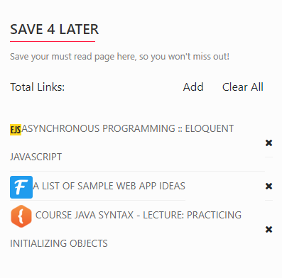

# Save4Later.js
A Chrome extension library to save all your must-read list in Chrome storage instead of clustering bookmark bar

## Screenshot

## Installation
- Go to [Chrome Extension store](https://chrome.google.com/webstore/category/extensions)
- Search for Save4Later
- Install and enjoy!

## TODO
- [x] Add/Delete/Clear functionality
- [ ] Total Link status update
- [ ] Fix favicon bug size
- [ ] List refresh latency problem(callback)
- [ ] Refactor code to module

## License
Licensed under MIT License

See [LICENSE.md](./LICENSE.md) for more information.
